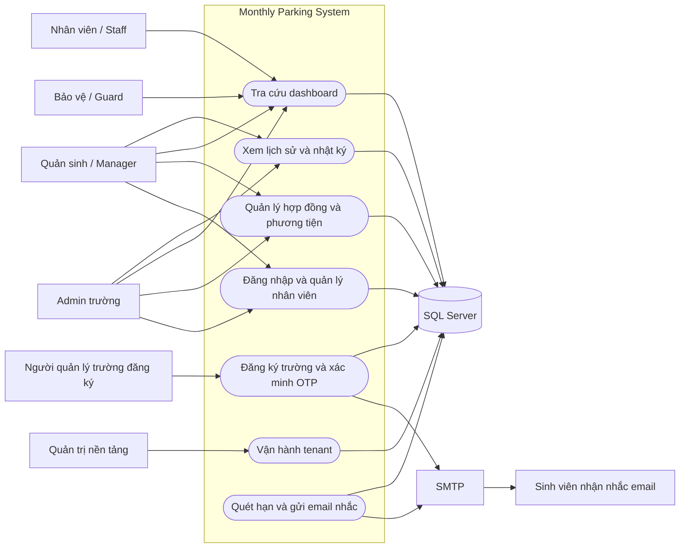
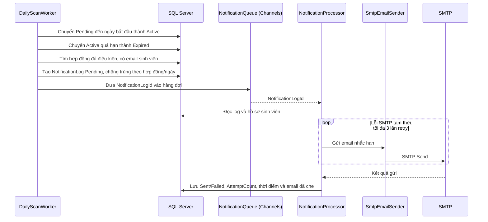
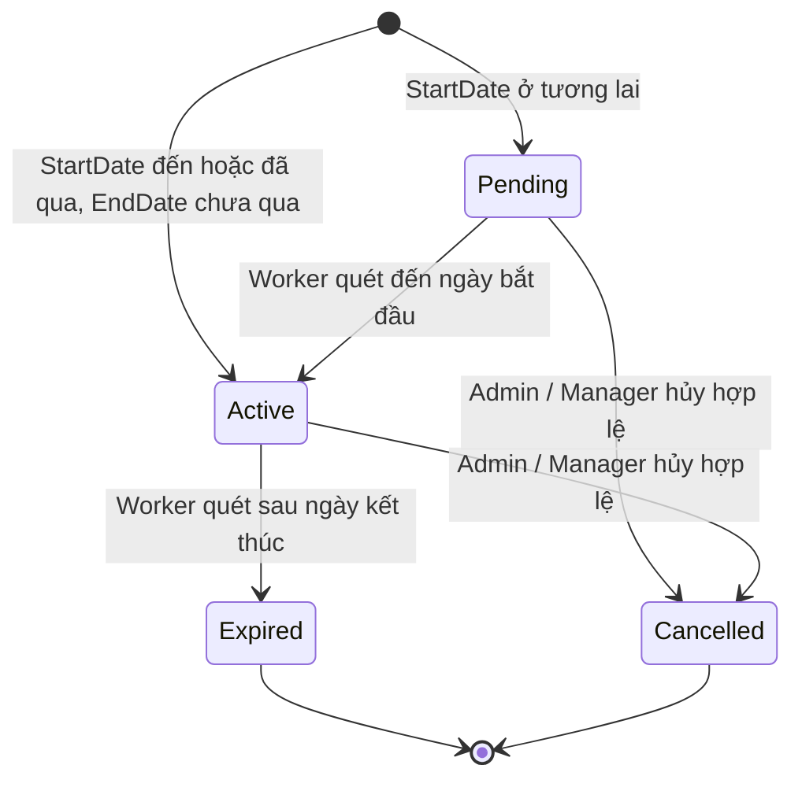
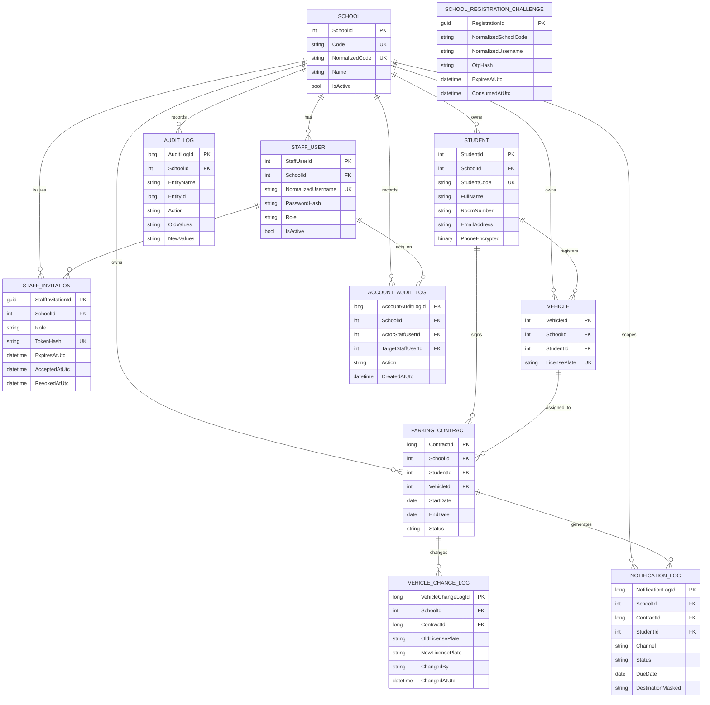
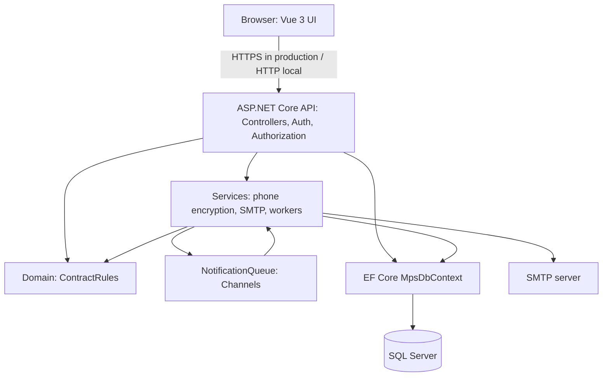

# Phân tích và thiết kế hệ thống MPS

**Phiên bản:** 1.0
**Ngày:** 03/10/2026
**Mục đích:** Cung cấp sơ đồ nghiệp vụ, dữ liệu, trạng thái và ma trận truy vết để hỗ trợ phát triển, kiểm thử và bảo vệ đồ án.

## 1. Biên hệ thống và tác nhân



Sinh viên là người nhận email và chủ thể dữ liệu, không có tài khoản trong phạm vi hiện tại. SMTP là dịch vụ ngoài; không có kết nối SMS/Zalo trong phiên bản này.

## 2. Luồng nghiệp vụ

### 2.1 Đăng ký trường bằng email OTP

```mermaid
sequenceDiagram
    actor Applicant as Người đăng ký
    participant Web as Trang đăng ký
    participant API as SchoolRegistration API
    participant SMTP as SMTP
    participant DB as SQL Server

    Applicant->>Web: Nhập thông tin trường, Admin và email
    Web->>API: Yêu cầu gửi OTP
    API->>DB: Lưu challenge, hash OTP, hạn dùng và số lần thử
    API->>SMTP: Gửi OTP tới email
    SMTP-->>Applicant: Email chứa OTP
    Applicant->>Web: Nhập OTP
    Web->>API: Xác minh OTP
    API->>DB: Kiểm tra hash, thời hạn, giới hạn thử
    alt OTP hợp lệ
        API->>DB: Transaction tạo School và Admin đầu tiên
        DB-->>API: Commit
        API-->>Web: Kết quả đăng ký và mã trường
    else OTP sai, hết hạn hoặc quá giới hạn
        API-->>Web: Từ chối; không tạo tenant/tài khoản
    end
```

### 2.2 Tạo hợp đồng

```mermaid
sequenceDiagram
    actor Manager as Admin / Manager
    participant Web as Dashboard
    participant API as Contracts API
    participant Auth as JWT và phân quyền
    participant DB as SQL Server

    Manager->>Web: Nhập sinh viên, email, xe và ngày hợp đồng
    Web->>API: POST /api/v1/contracts + Bearer JWT
    API->>Auth: Xác thực người dùng và school_id
    Auth-->>API: Danh tính tenant đã xác thực
    API->>DB: Begin transaction Serializable
    API->>DB: Tìm/tạo Student; kiểm tra khoảng ngày và biển số
    alt Dữ liệu vi phạm quy tắc
        API->>DB: Rollback
        API-->>Web: 409 Conflict hoặc 400 Bad Request
    else Hợp lệ
        API->>DB: Lưu Vehicle, ParkingContract và AuditLog
        API->>DB: Commit
        API-->>Web: 201 Created
    end
```

### 2.3 Quét hạn và gửi email



SMTP chỉ được gọi khi đã cấu hình. Log Pending được lưu trong database; Channels là queue trong bộ nhớ tiến trình nên chưa hỗ trợ điều phối nhiều instance hoặc idempotency đầu-cuối.

## 3. Vòng đời hợp đồng



`ExpiringSoon` không phải trạng thái lưu. Dashboard tính nhãn này cho hợp đồng Active có `EndDate` từ hôm nay đến hết hôm nay cộng ba ngày.

## 4. Mô hình dữ liệu



`SchoolRegistrationChallenge` là bản ghi tạm trước khi tenant tồn tại, vì vậy chưa có khóa ngoại tới `School`. `AuditLog.EntityId` là khóa tổng quát cho nhiều loại entity; truy vấn audit phải luôn kèm `SchoolId`. Các uniqueness và FK ghép cụ thể được cấu hình trong `MpsDbContext` và SQL scripts.

## 5. Ma trận truy vết yêu cầu

| Yêu cầu PRD | Epic | Thành phần/API | Dữ liệu chính | Hướng kiểm thử |
| --- | --- | --- | --- | --- |
| FR-01 | 5.1/5.2 | `SchoolRegistrationController`; send/verify OTP | `SchoolRegistrationChallenges`, `Schools`, `StaffUsers` | OTP đúng/sai/hết hạn; không tạo một phần; rate limit |
| FR-02 | 5 | `PlatformController` | `Schools`, `StaffInvitations` | khóa hợp lệ/sai; tenant tạm ngưng; lời mời Admin |
| FR-03 | 4 | `AuthController` login | `StaffUsers`, `Schools` | đúng/sai; lockout; tài khoản hoặc trường inactive |
| FR-04 | 4 | API staff/invitations/active/audit | `StaffUsers`, `StaffInvitations`, `AccountAuditLogs` | role matrix; token một lần; cô lập tenant |
| FR-05 | 1 | `POST /api/v1/contracts` | `Students`, `Vehicles`, `ParkingContracts`, `AuditLogs` | trường hợp hợp lệ; trùng plate; overlap; rollback |
| FR-06 | 1 | `PUT /api/v1/contracts/{id}` | `Students`, `ParkingContracts`, `AuditLogs` | cập nhật shared student; email; hợp đồng hủy; date range |
| FR-07 | 1 | `PUT /api/v1/contracts/{id}/change-vehicle` | `Vehicles`, `VehicleChangeLogs` | đổi xe; plate trùng; lịch sử cũ/mới |
| FR-08 | 1 | `PUT /api/v1/contracts/{id}/cancel` | `ParkingContracts`, `AuditLogs` | hủy Active/Pending hợp lệ; giữ history |
| FR-09/10 | 2 | `GET /stats`, `GET /expiring` | `ParkingContracts`, `Students`, `Vehicles` | thống kê, lọc, phân trang, tenant scope |
| FR-11 | 3 | `DailyScanWorker` | `ParkingContracts`, `NotificationLogs` | Pending→Active, Active→Expired, khử trùng due date |
| FR-12 | 6 | `NotificationProcessor`, `SmtpEmailSender` | `NotificationLogs` | SMTP configured/unconfigured; retry; sent/failed; mask email |

## 6. Phân rã kiến trúc hiện hành



Hiện backend nằm trong một project ASP.NET Core. `Domain/Contracts/ContractRules` giữ quy tắc hợp đồng thuần và các biểu thức truy vấn để controller/worker dùng chung; controller vẫn điều phối transaction và một phần truy vấn EF. Đây chưa phải Clean Architecture tách project. Unit test cho quy tắc domain nằm trong `MonthlyParkingSystem.Tests`; integration test với SQL Server, phân quyền và tenant isolation còn cần bổ sung. LocalDB và queue trong bộ nhớ phục vụ phát triển/demo; production cần database hosted, secrets ổn định, HTTPS, CORS allowlist và thiết kế queue/outbox phù hợp nhiều instance.
